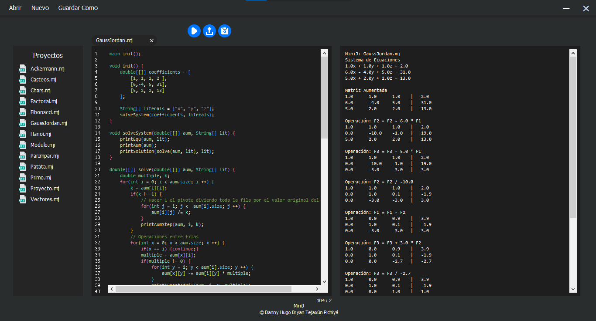
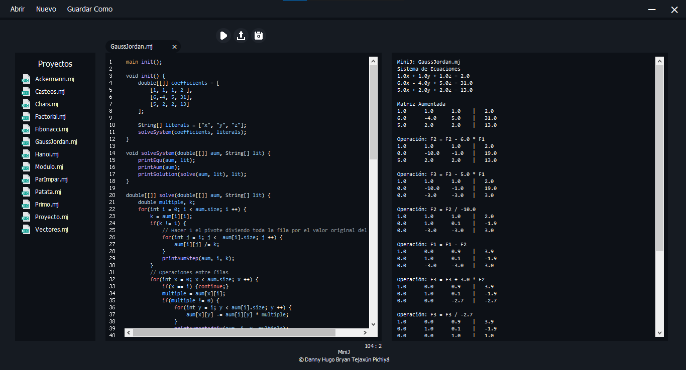
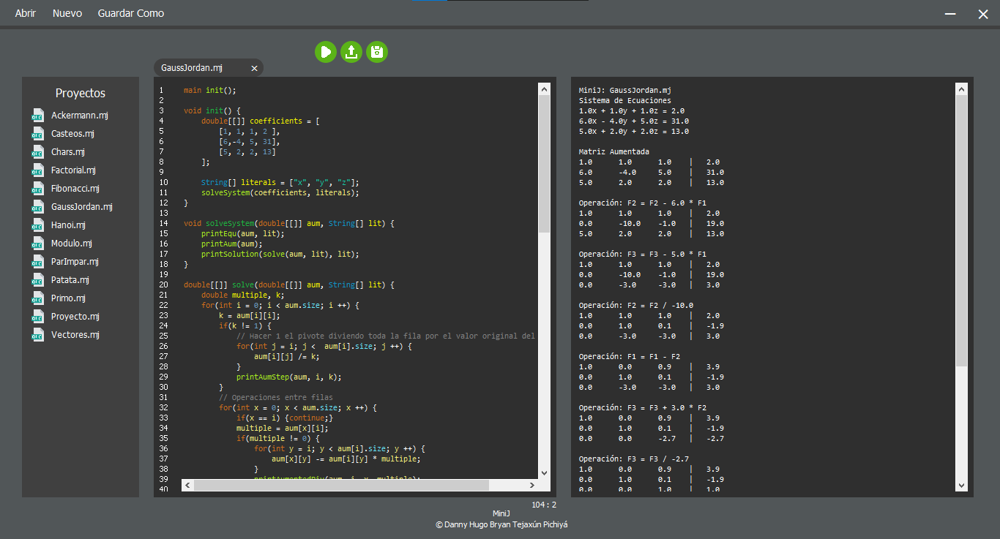

# MiniJInterpreter
## Intérprete de Código: JavaCC
Versión minimizada de c++.  
Implementa patrón de diseño interpreter.

## VSCode Theme


## GitHub Theme


## Eclipse Theme


## Gramática Libre del Contexto
```java
INIT := INSTRUCTIONS EOF

INSTSGLOBAL ::= INSTGLOBAL*

INSTGLOBAL ::=
    CALLMAINFUNC |
    DECLID       |
    DECLFUNC     

CALLMAINFUNC ::= 'main' CALLFUNC ';'

CALLFUNC ::= TK_id '(' LISTARGS ')'

LISTARGS ::= (EXP (',' EXP)*)?

DECLID ::= TYPE INITIDS ';'

INITIDS ::= TK_id ('=' EXP)? (',' TK_id ('=' EXP)?)*

DECLFUNC ::=
    TYPE   TK_id '(' LISTPARAMS ')' ENV |
    'void' TK_id '(' LISTPARAMS ')' ENV

LISTARGS ::= (TYPE TK_id (',' TYPE TK_id)*)?

IFSTRUCT ::= 'if' '(' EXP ')' ENV ('else' (IFSTRUCT | ENV))?

SWITCHSTRUCT ::= 'switch' '(' EXP ')' ENVS

ENVS ::= '{' CASESDEFAULT '}'

CASESDEFAULT ::= (CASES)? (DEFAULT)?

CASES ::= (CASE)+

CASE ::= 'case' EXP ':' (ENV | INSTRUCTIONS)

DEFAULT ::= 'default' ':' (ENV | INSTRUCTIONS)

LOOPFOR ::= 'for' '(' ARGSFOR ')' ENV

ARGSFOR ::= (UPDATESFOR)? ';' (EXP)? ';' (UPDATESFOR)?

INITIALIZEFOR ::=
    TYPE INITIDSFOR |
    REASIGNS        

INITIDSFOR ::= TK_id '=' EXP (',' TK_id '=' EXP)*

REASIGNS ::= REASIGN (',' REASIGN)*

UPDATEFOR ::=
    INCDEC  |
    REASIGN |
    ADDSUB  

LOOPWHILE ::= 'while' '(' EXP ')' ENV

LOOPDOWHILE ::= 'do' ENV 'while' '(' EXP ')' ';'

REASIGN ::= TK_id '=' EXP

INCDEC ::= TK_id ('++' | '--')

ADDSUB ::= TK_id ('+=' | '-=') EXP

PRINT ::= 'PRINT' '(' EXP? ')' ';'

ENV ::= '{' INSTRUCTIONS '}'

INSTRUCTIONS ::= INSTRUCTION*

INSTRUCTION ::=
    DECLID              |
    IFSTRUCT            |
    SWITCHSTRUCT        |
    LOOPFOR             |
    LOOPWHILE           |
    LOOPDOWHILE         |
    REASIGN         ';' |
    ADDSUB          ';' |
    INCDEC          ';' |
    CALLFUNC        ';' |
    PRINT               |
    'return' (EXP)? ';' |
    'continue'      ';' |
    'break'         ';'

TYPE ::=
    RW_String  |
    RW_int     |
    RW_boolean |
    RW_char    |
    RW_double  

EXP ::= opOr ('?' opOr ':' opOr)?

opOr ::= opAnd ('||' opAnd)*

opAnd ::= opEqu ('&&' opEqu)*

opEqu ::=
    opCmp ('==' opCmp)* |
    opCmp ('!=' opCmp)* 

opCmp ::=
    opAdd ('<=' opAdd)* |
    opAdd ('>=' opAdd)* |
    opAdd ('<' opAdd)*  |
    opAdd ('>' opAdd)*  

opAdd ::=
    opMult ('+' opMult)* |
    opMult ('-' opMult)* 

opMult ::=
    unary ('*' unary)* |
    unary ('/' unary)* 

unary ::=
    '-' unary |
    '!' unary |
    primitive 

primitive ::=
    INCDEC      |
    CALLFUNC    |
    TK_id       |
    TK_string   |
    TK_char     |
    TK_int      |
    TK_double   |
    RW_true     |
    RW_false    |
    '(' EXP ')' 
```

## Instalación JavaCC
* Descargar javacc: [JavaCC](https://javacc.github.io/javacc/)
* Buscar la carpeta ```./javacc/scripts``` y copiar la dirección.
* Pegar la dirección en las variables de entorno.
    * Buscar ```Path``` en variables del sistema.
    * Pegar la ruta copiada. ```./javacc/scripts```

## Generación de Parser
* Ejecutar el comando ```javacc Parser.jj``` en la ubicación del archivo con extensión .jj para generar el código del parser.

## Versión de Intérprete con JFlex y CUP
Usuario: [brandonT2002](https://github.com/brandonT2002)  
Repositorio: [MiniJ](https://github.com/brandonT2002/MiniJ)